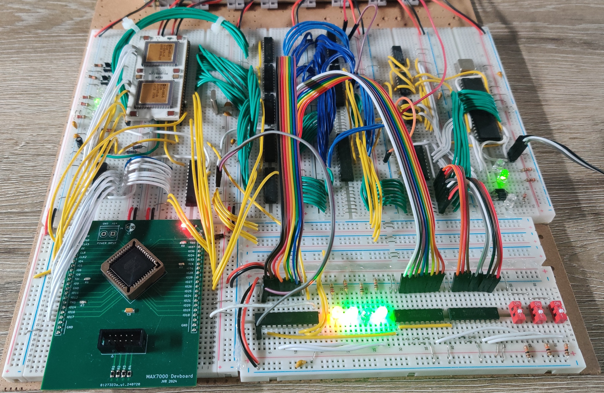

# JVR11 Homebrew Minicomputer - Hardware

  

This repository contains all schematics, PCB designs and PLD design sources of the JVR11, a homebrew minicomputer built around the DEC DCJ11 microprocessor. The computer will be built in multiple phases, each described in detail below.

All schematics and PCBs are designed in KiCad. All designs targeting SPLDs like the GAL16V8 and 22V10 are designed in WinCUPL, except the old sources, which were designed in GALASM. These will be replaced later. The CPLDs I used are all part of the ATF1504AS series, which can be used as an alternative to the MAX7000 series. All RTL is written in SystemVerilog and compiled using an older version of Quartus, targeting the MAX7000 series. The outputs were then converted to JEDEC using Atmel's POF2JED tool.

## Goals
### Phase 1: ODT Console    (FINISHED)

This is the very first stage of the project. My goal is to build a minimal but functional system capable of running a simple program. All the computer needs is a UART used to interact with the built-in ODT console and a little bit of SRAM to peek/poke into. This UART interface is built around the (Harris) 6402. Programs can be entered manually into memory and executed using this console, so no ROM is required. The ODT console itself is implemented in the processor's microcode.

The computer also needs to be able to load some startup configuration from a special register during its power-up sequence. A GAL22V10 is used as an interface to this register, I call it the "GP-interface". "GP" refers to the general-purpose cycles, which is a special kind of bus transaction that plays a big role during the power-up sequence. In addition, this interface is also responsible for generating the bus-reset signal and driving some status LEDs indicating whether the processor is in its "ODT mode" and also the results of the three microdiagnostics tests. All of this will be moved to the front panel later.

Known problems:
- The reset pin of the UART seems to be very sensitive to noise. When it is driven by the bus-reset signal, it starts to misbehave. This is because everything is still built on breadboards, which is definitely not ideal for this kind of builds. As a temporary solution, I connected a schmitt trigger inverter (74HCT14) to the active-low bus-reset to form a more stable reset signal for the UART. This inverter is probably not required anymore once the circuit moves to PCB, especially since the bus-reset signals will get buffered anyways.

### Phase 2: Bus Controller Upgrade     (IN PROGRESS)
In the previous phase, the computer used a single GAL16V8 to generate the bus access strobes (read enable, write enable etc). While being sufficient for a minimal functional system, it lacks a lot of functionality that we'll depend on later. This phase is all about implementing this missing functionality. First of all, it lacks the possibility to extend the cycle by inserting wait states. This will be required when interacting with slower IO devices and also in case of a cache miss. Second, since I'm planning to add DMA in the future, we need to support bus arbitration in order to be able to request mastership over the bus. Finally, we did not care about abort conditions. The internal MMU is capable of generating internal error conditions in which the remainder of the current cycle must be ignored and the access strobes are to be inhibited. An abort can also be generated by external hardware, but under specific conditions. In our case the system may report an error when referring to non-existent memory/IO or when writing to a read-only location or reading from a write-only location.

### Phase 3: Memory Subsystem     (FINISHED)
~~Every computer needs random-access memory. The J11 is capable of addressing 4MiB of physical memory of which the top 8K is reserved for memory-mapped IO. The remainder will be filled by RAM and a bit of ROM. Filling almost 4MiB with SRAM is practically possible with modern chips, but that would violate one of my most important constraints: keeping it as historically correct as possible. Therefore I will be using asynchronous DRAM.~~ 

~~Dynamic memory has two serious disadvantages: it's slow and needs periodic refreshes, or the data you stored will be lost. When it comes to refreshing the memory at regular intervals, I want to keep it as transparent to the CPU as possible by implementing a dedicated controller that runs on its own clock domain. When it comes down to the DRAM speeds, a single layer of write-back direct-mapped cache will be added which will act as a faster buffer between the fast system and its slow memory. The cache will offer 32KiB of SRAM to buffer both instructions and data (still unified), organized as 8K 32-bit cache blocks.~~

My original goal was to use DRAM for the system's main memory, using a dedicated controller that makes the access timing and refreshing completely transparent to the rest of the system. Since DRAM is slow, I wanted to introduce a write-back cache. I ended up moving the cache into the memory subsystem rather than keeping it local to the processor, which might sound like a questionable design choice (I admit it is), but it solved all coherency related problems because all memory accesses go through the same cache, even those initiated by the DMA controller.

I spent a couple of months working out a datapath and a control path and ended up with something that seamed to work, but it had some problems. The DRAM controller became a bottleneck, its worst-case latency was so high it was just unacceptable. I must mention one of my constraints for this project: I do not want to use any programmable logic device more capable than a simple MAX7000 CPLD with 64 macrocells. The overall performance can be greatly improved by designing a better DRAM controller, but that would require a lot more than 64 macrocells.

Improving the current memory system is simply impossible given my constraints, so I had to make a difficult decision: I decided to roll back to SRAM, which is simple to interface, fast enough to not need caching, but more importantly, it doesn't require a sophisticated memory subsystem anymore.

### Phase 4: IO Bridge  (IN PROGRESS)
Depending on the exact version, the J11 can run at a maximum clock speed of either 15MHz or 18MHz. That is way too fast to interface with slower IO controller chips directly. The simplest solution would be to rely on the wait state mechanism implemented by the bus controller to relax the speeds, but for write cycles that will cause stalls that could be avoided. Instead, a bridge can be added which buffers the write transactions targeting the slower IO devices behind it. The CPU can "deposit" the write data into this bridge at its full operating speed and resume execution while the IO bridge "proxies" that transaction on the slower bus. Unfortunately, read transfers cannot be buffered.

### Phase 5: Interrupts & DMA  (NOT STARTED)
The J11 supports vectored interrupts on multiple priority levels. A dedicated interrupt controller will be required to provide the vector address to the processor during an interrupt acknowledge cycle. I want those vector addresses to be fully programmable.

For high-throughput IO devices DMA can be used to transfer data without the processor's involvement. I want to build a flexible DMA controller that is fully programmable, has multiple channels with internal prioritization, can handle both 8 or 16 bit word sizes, can handle memory-to-memory transfers and can handle chained/scatter-gather transfers. The latter is required since the J11's internal MMU can map non-consecutive pages. Its design is inspired by the Motorola 68450 DMAC.

### Phase 6: Adding More IO  (NOT STARTED)
The most fundamental objective of this project is to build a minicomputer. While there is no real definition of what makes a computer a minicomputer, my interpretation of a minicomputer is a "big" computer that has multi-user capabilities and a lot of IO. From a hardware point of view, this is the moment where the homebrew computer turns into a proper minicomputer. With the IO bridge in place and interrupts and DMA being supported, it is finally time to start adding more and more IO devices to the system. I will add as much as I can, including: storage, timers, displays, sound, and more.

### Phase 7: VGA Subsystem  (NOT STARTED)
I always wanted to build my own VGA subsystem, so this is my chance. I got inspired by two unrelated video controllers: [James Sharman's VGA](https://youtube.com/playlist?list=PLFhc0MFC8MiD2QzxJKi_bHqwpGBZZpYCt&feature=shared) and the IBM PGA. James Sharman built a VGA controller completely from scratch, featuring advanced functionality such as scrolling, beam racing, tilemaps and more. The PGA on the other hand is a less-known video controller made by IBM that had a 8088 on board serving as a coprocessor. It could emulate a CGA, but more interestingly, it could be used to offload high-level commands. These two video controllers are completely different: on one hand we have complex functionality implemented in hardware and on the other we have software emulation. That raises one important question: Can we combine the best of both worlds? Can we build a VGA controller that implements complex functionality in hardware but also features a dedicated coprocessor that can offload things from the J11?

I don't have any concrete plans yet and I don't know how far I will take this, if I can even get to this point. But, I am sure about one thing: the 8088 is a great processor but if I were going to use a coprocessor I'd choose a less common processor. If possible, I want to keep it minicomputer-related. Or even better, DEC-related so both processors share some common history. That left me with one specific processor: the DEC DCT11. The J11 and the T11 both implement the PDP-11 instruction set, but other than that they do not have anything in common.

## Current Status (May 2026)
 

In the past two months I have been working on the IO bridge (right) and a new version of the core (left). At this moment, the prototype of the IO bridge is ready to be tested. I want to make sure the new version of the core is completely functional before integrating the IO bridge, hence the reason why the bridge isn't wired up to the computer just yet. 

The most important changes in the newest version computer's core are:
  -  **More memory**: The two 16KiB SRAM chips have been replaced by two 128KiB SRAM chips and ROM has been added.
  -  Bus buffers: In the previous version I used a set of 74x245 bidirectional buffers to drive the databus. Those are replaced by 74x541 unidirectional buffers, mainly for speed and to avoid brief contention when the direction changes while the outputs were active.
  -  **Address decoder**: The temporary decoder has been replaced by what I call the primary decoder. It is still an address decoder, but the main difference is that it selects larger subsystems (minimum 8KiB chunks) rather than individual peripherals like the UART. The new decoder can also generate aborts in case of non-existent memory or access violations (eg. writing to ROM). Until the IO bridge is in place, some temporary logic is used to decode the IO bridge select further down into a chip select for the ODT UART.
  - **Bus Error subsystem**: This is a small subsystem that can help the software to recover from bus errors. It latches additional context like the error type (4 bits) into a register that is readable by the processor and also serves as a configuration register that can enable or disable certain types of bus error. This register will be called the BER (Bus Error Recovery Register), which maps to a currently unused system register. This subsystem will not be used when the CPU is not the bus master since devices like the DMA will use its own error handling semantics.
  - **Bus controller**: The bus controller got a big upgrade. Its intent did not change, but it got a bit more sophisticated. In the last version the controller consisted of a MAX7000 CPLD and a 22V10 because this CPLD did not have enough pins to fit everything on a single chip. Now it has been replaced by a PLCC-84 version this CPLD, which offers more than enough usable pins.

**Next Steps:**

The new core has been built on breadboard and is almost ready to be tested. I am still writing the RTL for the new bus controller. Once the core is finished, the IO bridge can finally be integrated. After that, the next step would be the interrupt controller and finally moving existing parts of the build to PCB.

## Special thanks to PCBWay!
 

I would like to sincerely thank PCBWay for sponsoring this project. Their support has been invaluable in bringing this work to life. PCBWay is a leading manufacturer specializing in high-quality printed circuit boards, offering services ranging from rapid PCB prototyping to full-scale production. In addition to PCBs they also provide services like PCB assembly, CNC, 3D printing and more. 

I have been very pleased with the quality of the PCBs and SMD stencils I received. The precision, finish, and reliability exceeded my expectations. Overall, my experience with PCBWay has been excellent. Therefore I highly recommend others to check out [PCBWay](https://www.pcbway.com/) for their own projects.

 A picture of the boards I received:   

## License
The content of this project is licensed under the [CERN-OHL-P version 2 license](https://cern-ohl.web.cern.ch/).
